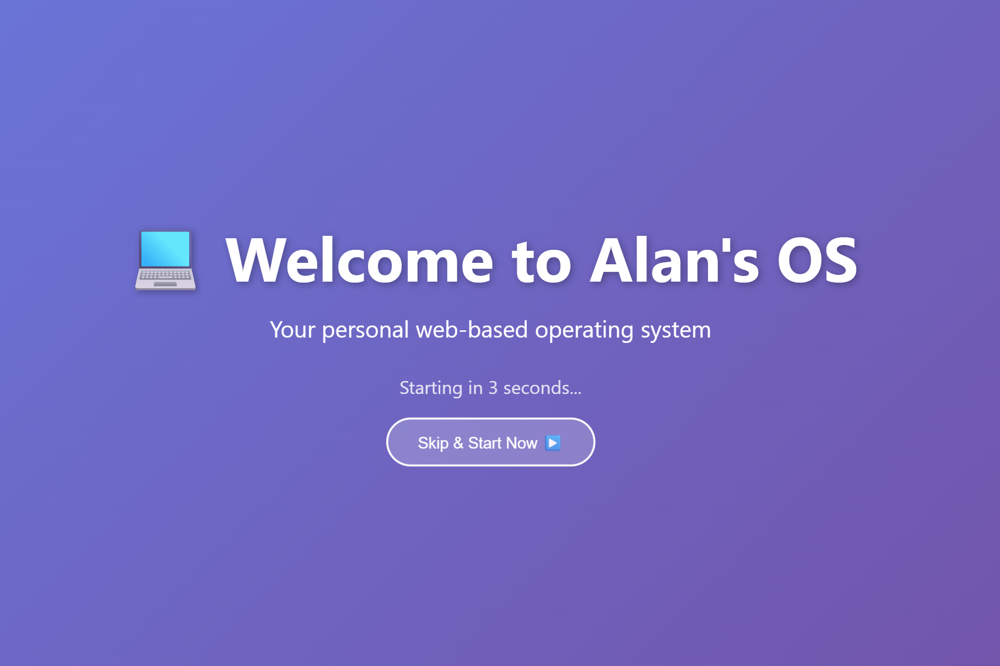

# SimpleOS

A browser-based virtual operating system built with vanilla JavaScript — no frameworks, no build tools, no dependencies.

**Live:** [https://alanh0vx.github.io/](https://alanh0vx.github.io/)



---

## What is SimpleOS?

SimpleOS is a simulated desktop operating system that runs entirely in the browser. It features draggable/resizable windows, a taskbar with a start menu, a virtual file system, and a collection of built-in apps — all rendered with pure HTML, CSS, and JavaScript.

## Features

- **Window Management** — Drag, resize, minimize, maximize, and close windows just like a real OS
- **Start Menu & Taskbar** — Launch apps and switch between open windows
- **Virtual File System** — Create, edit, and organize files and folders (persisted in localStorage)
- **Desktop Icons** — Apps organized by category with double-click to launch
- **Mobile Support** — Responsive layout with touch-friendly app grid (breakpoint at 768px)
- **Splash Screen** — Animated boot sequence on load
- **Data Persistence** — All state saved locally via localStorage (no backend required)

## Built-in Apps

| Category | App | Description |
|---|---|---|
| **Productivity** | Notepad | Text editor with file save/load |
| | Calculator | Standard calculator |
| | Clock | Desktop clock |
| | World Clock | Multi-timezone clock |
| **Utilities** | File Manager | Browse and manage the virtual file system |
| | Terminal | Command-line interface |
| | Browser | Embedded web browser (iframe-based) |
| | Settings | OS configuration |
| | Help | User guide and documentation |
| **Games** | Snake | Classic snake game |
| | Tic Tac Toe | Play against the computer |
| | Minesweeper | Grid-based puzzle game |
| | Memory | Card matching game |
| **Creative** | Paint | Drawing canvas with tools and colors |
| | Music Player | Audio player |
| **AI** | AI Chat | Chat interface supporting OpenAI API and custom endpoints |
| **Custom** | App Creator | Write and load your own apps with the built-in editor |
| | External App Loader | Load apps from external URLs |

## Standalone Games

These are self-contained HTML games hosted alongside SimpleOS, also accessible from the OS as external apps:

| Game | Link |
|---|---|
| Greedy Snake | [Play](https://alanh0vx.github.io/snake/snake.html) |
| Tic Tac Toe | [Play](https://alanh0vx.github.io/tic/tic3.html) |
| Horse Racing | [Play](https://alanh0vx.github.io/horses/horses.html) |
| Tetris | [Play](https://alanh0vx.github.io/tetris/tetris.html) |
| Solar System | [Play](https://alanh0vx.github.io/solar_system/) |
| Star Gazing | [Play](https://alanh0vx.github.io/star_glazing/) |
| Villian Hitting | [Play](https://alanh0vx.github.io/villianhitting/) |

## Architecture

```
├── index.html              # Entry point — loads OS core and all apps
├── simple-os/
│   ├── os-core.js          # OS kernel: window management, app registry,
│   │                       #   virtual file system, taskbar, start menu
│   ├── styles.css          # All OS styling and responsive layout
│   └── apps/               # One JS file per app (self-registering modules)
│       ├── notepad.js
│       ├── calculator.js
│       ├── terminal.js
│       ├── ai-chat.js
│       └── ...
├── snake/                  # Standalone games (each is a self-contained HTML page)
├── horses/
├── tetris/
├── tic/
├── solar_system/
├── star_glazing/
└── villianhitting/         # Expo-based mobile game (web export)
```

### App Registration Pattern

Every app is a self-contained JS module that registers itself on the global `os` object:

```javascript
os.registerApp({
    id: 'app-id',
    name: 'Display Name',
    icon: '🎮',
    category: 'games',  // utilities | games | entertainment | productivity | system | ai | external | custom
    onLaunch(windowId) {
        const win = document.querySelector(`#${windowId} .window-body`);
        // Render app UI into the window
    }
});
```

Apps are loaded as `<script>` tags in `index.html` and automatically appear in the start menu and desktop.

## Development

**No build step required.** All files are served directly as static assets.

```bash
# Option 1: Open directly
open index.html

# Option 2: Local HTTP server
python -m http.server 8080
```

**Deploy:** Push to `main` — GitHub Pages auto-deploys.

## Tech Stack

- **Vanilla JavaScript** — No frameworks or libraries
- **CSS3** — Flexbox/Grid layout, animations, responsive design
- **localStorage** — Client-side persistence for file system, settings, and app data
- **GitHub Pages** — Static hosting with automatic deployment
