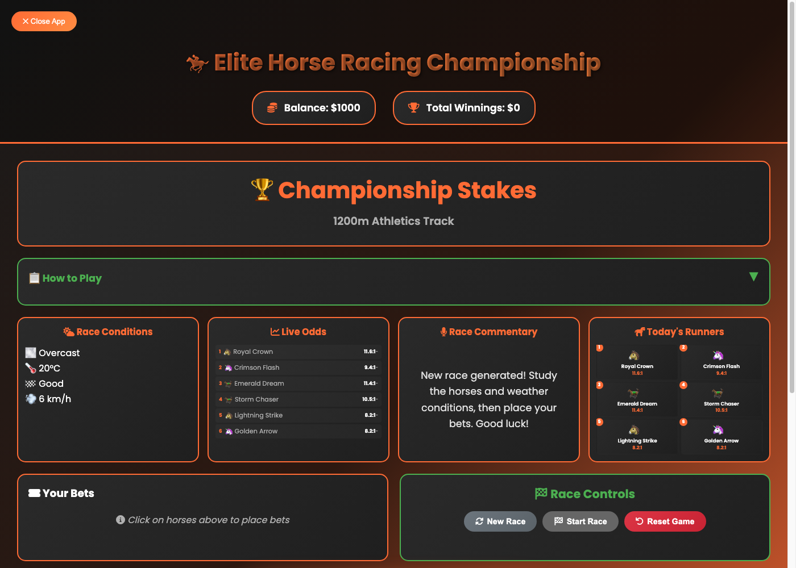
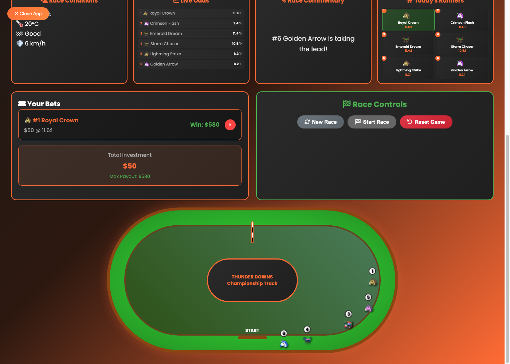
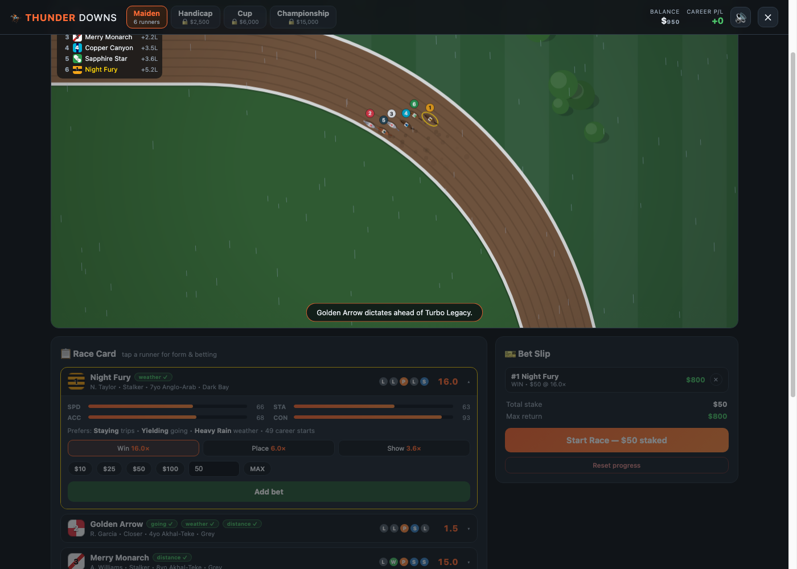
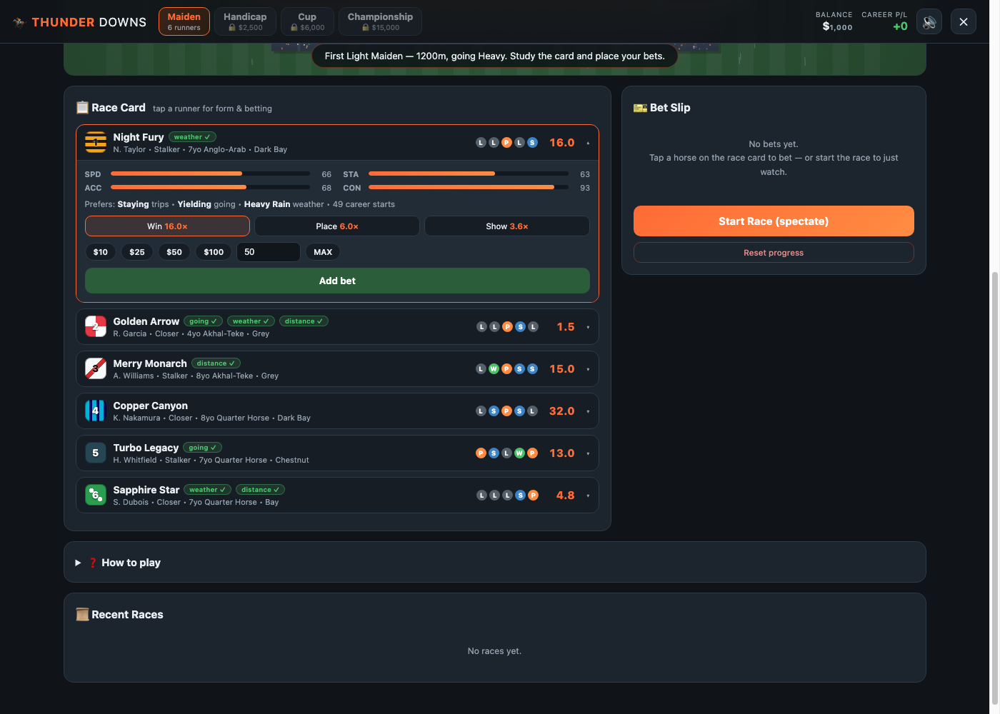
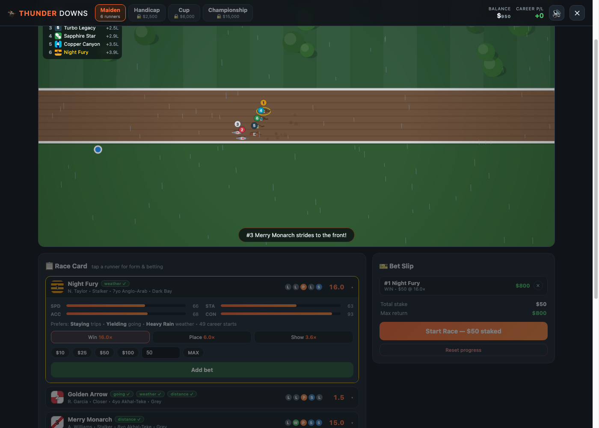
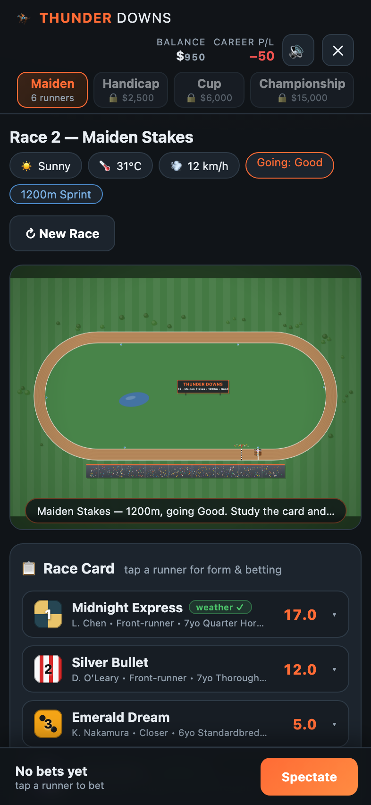

# From Emoji Slot Machine to Thunder Downs: Rebuilding a Horse Racing Game with Claude Fable 5

*How an AI pair-programmer turned 2,485 lines of vibes into a calibrated racing simulation — in one session, with zero dependencies.*

**Play it live:** [alanh0vx.github.io/horses/horses.html](https://alanh0vx.github.io/horses/horses.html)

---

## The starting point

The original "Elite Horse Racing Championship" was a fun weekend build: emoji horses (🐎🐴🦄) orbiting a CSS ellipse, random odds, and a betting system you couldn't lose at if you tried. It looked like this:





It worked, but under the hood almost everything was theater:

- **Odds were pure `Math.random()`** — `1.5 + Math.random() * 12`, completely unrelated to a horse's speed or stamina stats. The "live odds" ticker was random noise applied to random numbers.
- **The betting economics were broken.** Place paid a flat 1.5×, Show refunded your stake, and with average odds around 7× and no bookmaker margin, the expected value of betting was massively positive. You literally couldn't lose long-term.
- **The track coordinates were hardcoded** to an 800×400 layout (`const x = 400 + 330 * Math.cos(...)`), but the responsive CSS shrank the track to 300×300 on phones — so on mobile, horses flew off the track entirely and orbited empty space.
- **The race itself was one flat loop** where a random factor (`0.7 + Math.random() * 0.6`) dominated everything. No pace, no stamina that mattered, and the race hard-stopped the instant three horses finished — the rest just teleported into their placings.
- All six horses ran the *exact same ellipse path*, stacked on top of each other, distinguished only by a CSS `hue-rotate()` filter — which does nothing useful to emoji glyphs.

I handed the whole folder to **Claude Fable 5** with a one-line brief: *review, plan, and upgrade — better UI, UX, graphics, playable and realistic.* What came back is effectively a different game.



---

## Architecture: one file becomes four modules (still zero dependencies)

The repo rule is strict: GitHub Pages, no build step, no npm, no CDN. Fable 5 kept that constraint and split the monolith by responsibility:

```
horses/
├── horses.html          # structure only
├── horses.css           # design system w/ CSS custom properties
└── js/
    ├── engine.js        # pure logic: geometry, odds, simulation (Node-testable!)
    ├── renderer.js      # canvas: track, horses, camera, particles, weather
    ├── audio.js         # WebAudio: everything synthesized, no sound files
    └── game.js          # state machine, betting UI, persistence
```

The key move: **`engine.js` has zero DOM access.** It ends with `if (typeof module !== 'undefined') module.exports = Engine;` — which means the entire race simulation can be executed and statistically validated in Node, headlessly, thousands of races at a time. That one design decision is what made everything else in this post measurable instead of guessed.

---

## The odds problem, or: how to make betting a skill game

This was the most interesting engineering problem in the rebuild. A betting game is only fun if the odds *mean something* — favorites should win about as often as their price implies, longshots should occasionally shock, and the bookmaker should take a realistic cut.

### Step 1: Rate the horses

Each horse gets stats (speed, stamina, acceleration, consistency, experience), a running style (front-runner / stalker / closer), and preferences for distance category, going, and weather. An effective rating blends them with distance-dependent weights — sprints weight raw speed, staying trips weight stamina:

```js
const WEIGHTS = {
  sprint:  { speed: 0.45, stamina: 0.15, accel: 0.25, exp: 0.15 },
  mile:    { speed: 0.35, stamina: 0.30, accel: 0.15, exp: 0.20 },
  staying: { speed: 0.25, stamina: 0.45, accel: 0.10, exp: 0.20 },
};
```

Condition matches add rating points — a horse that prefers Soft going, on a Soft track, on its favorite distance, is genuinely faster today. The UI surfaces these as green ✓ badges on the race card, so *reading the form actually pays*.

### Step 2: Ratings → probabilities → prices

Win probabilities come from a softmax over ratings (`p ∝ e^(rating/6.5)`), and the market price is the fair price shaded by a bookmaker overround:

```js
h.fairOdds = 1 / h.prob;
const market = clamp((h.fairOdds / 1.16) * rand(0.94, 1.06), 1.25, 60);
```

That `1.16` is a ~16% overround — right in line with real-world racebooks. The pre-race "live market" now drifts around the fair price with mean reversion instead of pure noise.

### Step 3: Calibrate against the simulation

Here's where the Node-testable engine earned its keep. Fable 5 ran **400–600 full simulated races per iteration** and compared actual win rates against the odds' implied probabilities. The first attempt failed hard:

> **Iteration 1:** favorites won **52%** of races against ~31% implied. Betting the favorite every race was free money — the exact same flaw as the original, inverted.

The fix was tuning how much a horse's rating moves its raceday speed versus how much day-to-day randomness ("dayForm") it carries. After two tuning passes:

| Metric | Target | Final |
|---|---|---|
| Favorite win rate vs implied | ≈ equal | **37.7% vs 38.1%** |
| EV per $1 on the favorite | 0.85–0.95 | **0.87** |
| Outsider win rate vs implied | > 0, < implied | **1.7% vs 2.1%** |
| EV per $1 on the outsider | worse than favorite | **0.55** |
| Median winning margin | 1–3 lengths | **2.1 lengths** |
| Photo finishes (< 0.4 lengths) | occasional | **~10%** |

Two details worth calling out:

**The dead-longshot bug.** After the first calibration pass, outsiders won *zero* races out of 400. Softmax probabilities have fatter tails than a race decided by rating-plus-Gaussian-noise. The fix was fattening the tails of dayForm itself — a 9% chance of a "big day" and 9% chance of an "off day":

```js
dayForm: rand(0.968, 1.032)
       + (Math.random() < 0.09 ? rand(0.008, 0.035) : 0)
       - (Math.random() < 0.09 ? rand(0.008, 0.035) : 0),
```

After that, longshots land about once every 50–60 races — rare enough to feel like an event, real enough that the price isn't a lie.

**The favorite–longshot bias is emergent.** Favorites return $0.87 per dollar, outsiders $0.55. That asymmetry — long documented in real parimutuel markets — wasn't programmed in. It fell out of the same tail-shape mismatch that real bookmakers exploit.

### Step 4: Real bet pricing

Win/Place/Show now derive from the win price (`place = 1 + (win − 1) × 0.34`), and the higher race classes unlock **Exacta and Quinella**, priced from joint probabilities using the standard conditional formula:

```js
// P(A first AND B second) — Harville method
const p = a.prob * (b.prob / (1 - a.prob));
return clamp(0.82 / p, 4, 800);
```

---

## A race engine with actual racecraft

The old loop was `position += speed × random()`. The new simulation runs at a fixed 50ms timestep with distinct phases and mechanics:

- **Gate break** — acceleration modified by a per-race break quality roll, weighted by experience. Bad breaks happen (`breakQ < 0.88`) and the commentator calls them out.
- **Running styles** — front-runners go +4.5% early and pay for it late; closers concede the early lead and unleash a kick in the last 28% *if they still have energy*.
- **Energy model** — drain scales with `(v / sustainablePace)^3.6`, modulated by stamina, weather, and going. Burn too hot early and the fade multiplier drags you back to 82% speed in the straight. Stamina genuinely decides races now.
- **Lanes and traffic** — horses hold fractional lanes, pull out to overtake when blocked, drift back to the rail when clear. Running wide has a real cost: on turns, distance is scaled by `R / (R + laneOffset)` — cover more ground, lose more time. Sitting 2.5–7m behind another runner grants a slipstream bonus (+1.3% speed, −7% drain).
- **Pack compression** — the subtlest tuning knob. Pure independent simulation produced realistic *winners* but ugly *finishes* (the field strung out over 30 lengths). A gentle catch-up on trailing runners and a fractional ease on clear leaders tightened the median winning margin from 4.1 to 2.1 lengths — verified to leave favorite calibration untouched (37.7% before, 39.3% after, both within noise of implied).

The track itself is now parametric geometry in *meters*, not pixels: two 300m straights joined by 100m-radius semicircular turns (lap ≈ 1,228m), with a `pathPoint(s, offset)` function mapping distance-along-track + lateral offset to world coordinates. Race distances from 1000m sprints to 2400m staying tests all start from computed gate positions and finish at the same winning post — like a real course. The hardcoded-pixels mobile bug is structurally impossible now.

---

## Rendering: from CSS ellipse to a procedural broadcast camera

Everything on screen is drawn in code — no image assets, no sprite sheets:



- The **world is drawn in meters** through a camera transform (`ctx.setTransform(zoom·dpr, 0, 0, zoom·dpr, ...)`), so the renderer and the physics share coordinates.
- The **follow camera** computes the bounding box of live runners each frame, fits zoom to it (clamped between "whole track" and 6.5 px/m), and lerps position and zoom separately. It zooms in when the pack bunches and pulls back when the field strings out — like a TV director.
- **Horses are drawn top-down** with procedural gallop animation: four legs phase-offset on a stride cycle driven by actual velocity, jockeys in generated racing silks (10 color pairs × 6 patterns), saddle-cloth numbers, and a screen-space number bubble above each runner.
- One sneaky trick: at full-track zoom a real 2.4m horse would be ~4 pixels long. The renderer **oversizes horses inversely to zoom** (`k = clamp(20 / (2.6·zoom), 1, 3.6)`) — the same cheat every map-based racing game uses, and you never notice it happening.
- **Weather is physical**: rain renders as wind-angled screen-space streaks, the dirt darkens when wet, dust particles trail hooves on firm going and mud splashes on soft, and the grandstand crowd — 560 procedural pixel-people — starts jumping when the field turns for home.



The audio is equally asset-free: a brown-noise buffer filtered into gallop hits scheduled against the leader's speed, a band-passed crowd bed whose gain tracks race excitement, and a call-to-post bugle built from raw oscillator envelopes.

---

## The UX layer: tiers, consequences, and a reason to care

The old game had one repeating race. Thunder Downs has a career:

- **Four unlockable classes** — Maiden ($0) → Metro Handicap ($2.5k) → Golden Cup ($6k) → Championship ($15k) — with bigger fields, bigger bet limits, and exotics gating. Unlocks key off your *peak* balance, so a bad streak never re-locks progress.
- **Race history and career stats** persist in `localStorage` (old-version balances migrate automatically).
- Go broke and a track sponsor offers a $500 bailout — the game is a sandbox, not a punishment.
- Photo finishes get a freeze overlay before the stewards announce the result:


Note the margins: "by 1 length", finish times in the high 80s for 1200m on Heavy going — the going actually slowed the race, and the margin labels (`nose`, `short head`, `neck`, `¾ length`...) come straight from real racing vernacular, mapped from time gaps at ~16.2 m/s.

---

## The mobile pass (and the bug hunt that came with it)

A second session focused purely on making it feel native on iPhone:



The interesting part wasn't the features — it was the debugging loop. Fable 5 drove **headless Chrome over the DevTools Protocol** with a hand-rolled ~100-line Node script (no Puppeteer — the repo's no-dependency rule applied to tooling too): navigate, click through a real bet, run a full race, assert on the DOM, screenshot every stage, capture every console error.

That harness caught two classics:

1. **The invisible expander.** Race-card detail panels used `hidden` attributes… which were silently defeated by `.rc-expand { display: grid }`, because author styles beat the UA stylesheet's `[hidden] { display: none }`. Every panel rendered permanently open. One line fixes it: `.rc-expand[hidden] { display: none; }`.
2. **The 46-pixel mystery.** The iPhone viewport scrolled horizontally by 46px. The culprit — found by scripting a sweep over every element's `getBoundingClientRect()` — was the **CSS Grid blowout**: grid items default to `min-width: auto`, so a single wide child forced the whole `1fr` column past the viewport. The canonical fix: `.panels > * { min-width: 0; }`.

Plus the iOS-specific checklist: 16px inputs so Safari doesn't zoom on focus, `inputmode="numeric"` for the keypad, `env(safe-area-inset-*)` for the notch, `dvh` units for the URL-bar dance, `touch-action: manipulation`, 44px touch targets under `@media (pointer: coarse)`, and a sticky bottom bet bar so you can back a horse and start the race without ever scrolling to the slip.

Final verification, all automated: no horizontal overflow in portrait or landscape, bet → race → settlement → next race green, zero uncaught exceptions.

---

## By the numbers

| | Before | After |
|---|---|---|
| Files | 3 (HTML/CSS/JS) | 6, logic isolated & unit-testable |
| Odds | `Math.random()` | softmax ratings + 16% overround, sim-calibrated |
| Favorite EV | ~+40% (broken) | −13% (house edge, like real life) |
| Race sim | 1 loop, random walk | phases, energy, lanes, slipstream, traffic |
| Graphics | emoji + `hue-rotate` | procedural canvas, follow camera, particles |
| Track on mobile | horses fly off-screen | parametric geometry, resolution-independent |
| Sound | none | fully synthesized WebAudio |
| Bet types | Win/Place/Show (flat) | + Exacta, Quinella (Harville-priced) |
| Progression | none | 4 classes, history, career stats |
| Dependencies | Google Fonts + Font Awesome CDNs | **zero** |
| Testing | none | Node statistical suite + CDP end-to-end |

## Takeaways

1. **Make the core logic headless.** The single biggest enabler was `engine.js` running in Node. "Do favorites win as often as the odds say?" became a 5-second script instead of an afternoon of manual playtesting.
2. **Calibrate, don't vibe.** Every gameplay-feel change (margins, longshots, fades) was validated against hundreds of simulated races before shipping. The AI didn't just write the feature — it wrote the experiment that proved the feature.
3. **Constraints are a feature.** No build step and no dependencies forced procedural art, synthesized audio, and a raw-CDP test harness — and the result is a single folder of static files that will run unchanged for a decade on GitHub Pages.
4. **The browser is a fantastic game console** — if you respect `min-width: 0`.

*Built with Claude Fable 5 in Claude Code. The whole thing — review, plan, engine, renderer, audio, UI, calibration, mobile pass, and automated verification — happened in two conversational sessions.*
